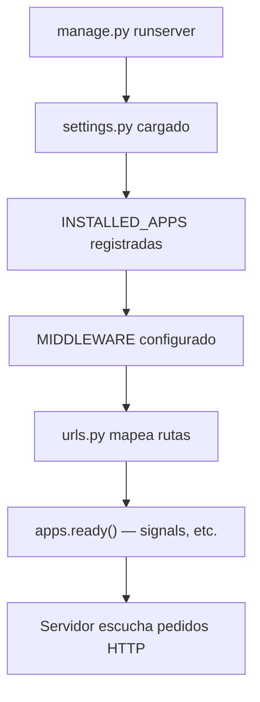
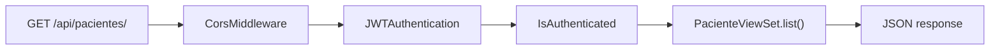

# Guía de estudio: fr_consultorio

## Capítulo 2 — Django: el proyecto, las apps y settings

> **Prerequisito:** Capítulo 1 (frontend/backend, SPA, REST, capas).
>
> **Cómo leerlo:** primero el **concepto general**, después **Django**, después **fr_consultorio**.

---

## 2.1 Recordatorio: no aprendas "Django de fr_consultorio", aprende "qué es un framework backend"

En el Capítulo 1 dijimos que `PacienteViewSet` es un **ejemplo** del rol "controlador de recurso REST".

Acá pasa lo mismo con Django:

| Receta específica | Concepto general |
|-------------------|------------------|
| Carpeta `backend/pacientes/` | **Módulo de dominio** (todo lo de una entidad de negocio) |
| `settings.py` | **Configuración central** del servidor |
| `manage.py runserver` | **CLI del framework** para desarrollo y tareas |
| `INSTALLED_APPS` | **Registro de módulos** que el framework debe cargar |
| `MIDDLEWARE` | **Cadena de filtros** que procesan cada pedido HTTP antes de llegar a tu código |
| `urls.py` | **Tabla de rutas** del servidor |

Si mañana abrís un proyecto **FastAPI**, **Express** o **Laravel**, vas a encontrar piezas equivalentes con otros nombres. La forma de leerlos es la misma: **¿qué rol cumple?**

---

## 2.2 ¿Qué es un framework backend?

### Concepto general

Programar un backend "desde cero" implica resolver muchas veces lo mismo:

- Recibir pedidos HTTP
- Conectar a una base de datos
- Validar datos
- Autenticar usuarios
- Organizar el código en carpetas
- Correr en producción

Un **framework** es un **esqueleto ya armado** con convenciones y herramientas para eso. Vos completás las partes de **tu negocio** (pacientes, turnos, pagos).

**Analogía:** construir una casa.

| Sin framework | Con framework |
|---------------|---------------|
| Fabricás ladrillos, cañerías, cableado desde cero | Te dan estructura, cañería base, normas de construcción |
| Máximo control, mucho trabajo repetido | Menos boilerplate, tenés que seguir las convenciones |

### Django en una frase

**Django** es un framework Python "batteries included" (baterías incluidas): trae ORM, admin, auth, routing, migraciones, etc. sin que los instales por separado.

**Django REST Framework (DRF)** es una **extensión** encima de Django, especializada en construir **APIs JSON** (no páginas HTML).

En fr_consultorio usás **Django + DRF** juntos.

### Equivalentes en otros ecosistemas

| Rol | Django | Otros |
|-----|--------|-------|
| Framework base | Django | FastAPI, Flask, Express, NestJS, Laravel |
| Capa API REST | DRF | Routers nativos de FastAPI, controllers de Nest |
| ORM | Django ORM | SQLAlchemy, Prisma, TypeORM, Eloquent |
| CLI | `manage.py` | `flask run`, `npm run dev`, `artisan` |

---

## 2.3 Proyecto vs App: dos niveles de organización

Django distingue dos cosas que confunden al principio:

### Proyecto (`config/`)

Es el **contenedor global**. Define configuración que afecta a todo: base de datos, apps instaladas, middleware, URLs raíz.

En fr_consultorio el proyecto se llama **`config`** (nombre elegido al crear el proyecto, no es obligatorio que se llame así).

```
backend/config/
├── settings.py    ← cerebro: config global
├── urls.py        ← rutas raíz del servidor
├── auth_views.py  ← endpoints de auth (fuera de una app de dominio)
├── auth_urls.py
├── wsgi.py        ← punto de entrada en producción
└── asgi.py
```

### App (`pacientes/`, `turnos/`, `caja/`)

Es un **módulo de dominio**: código agrupado por **área del negocio**, no por capa técnica.

```
backend/pacientes/
├── models.py
├── views.py
├── serializers.py
├── urls.py
├── admin.py
├── apps.py
├── signals.py
└── migrations/
```

**Regla mental transferible:** en cualquier backend grande vas a ver carpetas tipo `users/`, `billing/`, `orders/`. En Django se llaman **apps**. En NestJS serían **modules**. En Laravel, a veces **Service providers** + carpetas por dominio.

### ¿Por qué tres apps y no una sola?

Porque el consultorio tiene **tres áreas** distintas:

| App | Dominio |
|-----|---------|
| `pacientes` | Fichas, documentos, alertas, odontograma |
| `turnos` | Agenda |
| `caja` | Pagos y tipos de tratamiento |

Separarlas hace el código más fácil de encontrar, testear y mantener. **No es magia de Django**: es **separación por responsabilidad de negocio**.

---

## 2.4 `manage.py`: la consola de mando

```python
os.environ.setdefault('DJANGO_SETTINGS_MODULE', 'config.settings')
execute_from_command_line(sys.argv)
```

**Concepto:** punto de entrada CLI del framework. Le dice a Django dónde está la config y ejecuta comandos.

Comandos que vas a ver (genéricos + este proyecto):

| Comando | Qué hace |
|---------|----------|
| `python manage.py runserver` | Levanta servidor de desarrollo |
| `python manage.py migrate` | Aplica cambios de schema a la DB |
| `python manage.py makemigrations` | Genera archivos de migración desde models |
| `python manage.py createsuperuser` | Crea usuario admin |
| `python manage.py shell` | Consola Python con Django cargado |

**Equivalente genérico:** `npm run dev`, `flask db upgrade`, `rails db:migrate`. Siempre hay un **comando central** para operar el backend.

---

## 2.5 `settings.py`: el cerebro del servidor

Archivo: `backend/config/settings.py`

Todo lo que Django necesita saber **antes** de atender pedidos vive acá (o se lee desde variables de entorno).

### Mapa mental de un settings típico

```
settings.py
├── Paths (BASE_DIR)
├── Seguridad (SECRET_KEY, DEBUG, ALLOWED_HOSTS)
├── Apps registradas (INSTALLED_APPS)
├── Middleware (MIDDLEWARE)
├── URLs raíz (ROOT_URLCONF)
├── Base de datos (DATABASES)
├── Internacionalización (LANGUAGE_CODE, TIME_ZONE)
├── Archivos estáticos/media (STATIC_*, MEDIA_*)
├── Integraciones (REST_FRAMEWORK, CORS, JWT, Cloudinary…)
└── Producción (cookies seguras, proxy SSL…)
```

No hace falta memorizar cada línea. Hacé esto: **abrí settings.py y buscá la sección** cuando tengas una duda concreta.

---

## 2.6 `INSTALLED_APPS`: qué módulos están activos

```python
INSTALLED_APPS = [
    'django.contrib.admin',
    'django.contrib.auth',
    ...
    'rest_framework',
    'rest_framework_simplejwt',
    'corsheaders',
    'pacientes',
    'turnos',
    'caja',
]
```

**Concepto:** lista de **plugins/módulos** que Django carga al arrancar. Si una app no está acá, Django ignora sus models (en admin), signals, etc.

Tipos de entradas:

| Tipo | Ejemplo | Para qué |
|------|---------|----------|
| Built-in Django | `django.contrib.auth` | Usuarios, login, permisos |
| Librería tercera | `rest_framework`, `corsheaders` | API REST, CORS |
| Tus apps | `pacientes`, `turnos`, `caja` | Tu lógica de negocio |

**Transferible:** en NestJS sería el array de `imports` en `AppModule`. En Laravel, `config/app.php` providers. **Si algo "no funciona"**, una causa común es que **no está registrado**.

### Detalle: `apps.py` y registro explícito

`pacientes` usa config explícita:

```python
# settings.py
PACIENTES_APP = 'pacientes.apps.PacientesConfig'
INSTALLED_APPS = [..., PACIENTES_APP, ...]
```

```python
# pacientes/apps.py
class PacientesConfig(AppConfig):
    name = 'pacientes'

    def ready(self):
        import pacientes.signals  # conecta señales al arrancar
```

**Concepto `ready()`:** hook que corre **cuando la app termina de cargar**. Acá se importan **signals** (reacciones automáticas al guardar datos). Capítulo 3 profundiza models; acá alcanza saber que `apps.py` puede **inicializar comportamiento** al startup.

---

## 2.7 `MIDDLEWARE`: la cadena de filtros

```python
MIDDLEWARE = [
    'corsheaders.middleware.CorsMiddleware',
    'django.middleware.security.SecurityMiddleware',
    ...
    'django.contrib.auth.middleware.AuthenticationMiddleware',
    ...
]
```

**Concepto:** cada pedido HTTP **pasa por una fila de funciones** antes de llegar a tu view.

```
Pedido entrante
  → CorsMiddleware      (¿el frontend en Netlify puede llamar?)
  → SecurityMiddleware  (headers de seguridad)
  → SessionMiddleware   (sesiones, si las usás)
  → AuthMiddleware      (adjunta user a request si hay sesión)
  → ... tu ViewSet
  → respuesta
  (middleware también puede procesar la respuesta de vuelta)
```

**Analogía:** control de acceso en un edificio — revisión de identidad, detector de metales, recepción — **antes** de que llegues a la oficina (tu view).

**Transferible:** Express tiene `app.use(middleware)`, FastAPI tiene middlewares, Laravel tiene middleware en `Kernel.php`. **Mismo patrón.**

En fr_consultorio, **JWT se valida en DRF** (no en middleware de sesión clásico), pero CORS sí pasa por middleware al inicio.

---

## 2.8 `urls.py`: el mapa de rutas del servidor

Archivo raíz: `backend/config/urls.py`

```python
urlpatterns = [
    path('admin/', admin.site.urls),
    path('api/auth/', include('config.auth_urls')),
    path('api/', include('pacientes.urls')),
    path('api/', include('turnos.urls')),
    path('api/', include('caja.urls')),
]
```

**Concepto:** tabla que dice "si la URL empieza con X, mandá el pedido a Y".

| URL que llega | Quién la atiende |
|---------------|------------------|
| `/admin/` | Panel admin de Django |
| `/api/auth/login/` | `config/auth_urls.py` |
| `/api/pacientes/` | `pacientes/urls.py` → ViewSet |
| `/api/turnos/` | `turnos/urls.py` → ViewSet |

`include()` **delega** a otro archivo de rutas. Así cada app mantiene sus propias URLs.

**Transferible:**

- Express: `app.use('/api/pacientes', pacientesRouter)`
- FastAPI: `app.include_router(pacientes_router, prefix='/api/pacientes')`
- Capítulo 6 profundiza routers de DRF; acá alcanza ver que **urls.py es el mapa**.

---

## 2.9 Base de datos y variables de entorno

```python
DATABASES = {
    'default': dj_database_url.config(
        default=f"sqlite:///{BASE_DIR / 'db.sqlite3'}",
        ...
    )
}
```

**Concepto:**

- **Desarrollo local:** puede usar SQLite (archivo `db.sqlite3` en `backend/`).
- **Producción (Render):** usa `DATABASE_URL` apuntando a PostgreSQL.

También existe `USE_LOCAL_DB=true` para forzar SQLite aunque haya `DATABASE_URL` (útil para desarrollo aislado).

### Variables de entorno en settings

Muchos valores vienen de `os.environ.get(...)`:

| Variable | Para qué |
|----------|----------|
| `SECRET_KEY` | Firmar tokens, cookies, sesiones |
| `DEBUG` | Modo desarrollo (más errores visibles) |
| `ALLOWED_HOSTS` | Qué dominios pueden llamar al servidor |
| `DATABASE_URL` | Conexión a Postgres |
| `CORS_ALLOWED_ORIGINS` | Qué frontends pueden llamar a la API |
| `CLOUDINARY_*` | Subida de archivos a la nube |

**Regla universal:** **nunca** subas secretos al repo. En local: archivo `.env`. En producción: panel de Render/Netlify.

El proyecto carga `.env` al inicio de settings:

```python
_load_env_file(BASE_DIR / '.env')
```

---

## 2.10 Configuración de DRF, JWT y CORS (integraciones)

### REST_FRAMEWORK

```python
REST_FRAMEWORK = {
    'DEFAULT_AUTHENTICATION_CLASSES': [
        'rest_framework_simplejwt.authentication.JWTAuthentication',
    ],
    'DEFAULT_PERMISSION_CLASSES': [
        'rest_framework.permissions.IsAuthenticated',
    ],
    ...
}
```

**Concepto:** defaults globales de la API — "cómo autenticar" y "quién puede entrar" **salvo** que una view diga lo contrario (ej. login público).

### SIMPLE_JWT

Tokens de acceso (12 h) y refresh (7 días). Capítulo 7 profundiza auth.

### CORS

```python
CORS_ALLOWED_ORIGINS = [
    'http://localhost:5173',
    'https://fr-consultorio.netlify.app',
    ...
]
```

**Concepto:** el navegador **bloquea** por defecto que una web en Netlify llame a una API en otro dominio. CORS le dice al navegador: "estos orígenes están autorizados".

Sin CORS configurado, la SPA en producción fallaría aunque la API funcione perfecto en Postman.

---

## 2.11 `wsgi.py`: cómo entra el tráfico en producción

```python
os.environ.setdefault('DJANGO_SETTINGS_MODULE', 'config.settings')
application = get_wsgi_application()
```

**Concepto:** en desarrollo usás `runserver`. En producción, un servidor como **Gunicorn** importa `application` y atiende pedidos reales.

**Transferible:** todo backend tiene un "entry point" — `wsgi.py`, `main.py`, `index.js`, `server.ts`.

---

## 2.12 Django Admin: otro cliente de tu backend

Ruta: `/admin/`

Archivo: `backend/pacientes/admin.py` (y similares en otras apps)

```python
@admin.register(Paciente)
class PacienteAdmin(admin.ModelAdmin):
    list_display = ['apellido', 'nombre', 'dni', ...]
    search_fields = ['nombre', 'apellido', 'dni', ...]
```

**Concepto:** Django trae un **panel web automático** para ver/editar datos de la DB. Es **otro cliente** de tus models — **no usa la SPA React**.

| | SPA React | Django Admin |
|--|-----------|--------------|
| Usuario | Personal del consultorio | Admin técnico / superuser |
| Interfaz | Custom, Netlify | Generada por Django |
| Accede vía | API REST `/api/` | HTML en `/admin/` |
| Auth | JWT | Sesión Django |

**Importante:** ver admin no te enseña cómo funciona la SPA. Son **dos puertas** al mismo edificio (la base de datos).

---

## 2.13 Estructura completa del backend en fr_consultorio

```
backend/
├── manage.py                 ← CLI
├── requirements.txt          ← dependencias Python
├── db.sqlite3                ← DB local (si usás SQLite)
├── config/                   ← PROYECTO (global)
│   ├── settings.py
│   ├── urls.py
│   ├── auth_views.py
│   └── wsgi.py
├── pacientes/                ← APP dominio
├── turnos/                   ← APP dominio
└── caja/                     ← APP dominio
```

### Flujo: arranque del servidor



### Flujo: un pedido API



---

## 2.14 Cómo explorar un proyecto Django nuevo (checklist)

Cuando abras **cualquier** repo Django, recorré en este orden:

1. **`settings.py`** → DB, apps, integraciones, DEBUG
2. **`urls.py` raíz** → qué rutas existen
3. **Carpetas de apps** → dominios de negocio
4. **`models.py`** por app → qué datos hay (Cap. 3)
5. **`views.py` + `serializers.py`** → API (Cap. 4–5)
6. **`requirements.txt`** → librerías

No empieces leyendo archivos al azar. Seguí el **flujo de un pedido** del Capítulo 1.

---

## 2.15 Glosario del Capítulo 2

| Término | Una frase |
|---------|-----------|
| **Framework** | Esqueleto con convenciones para no reinventar infraestructura |
| **Proyecto Django** | Contenedor global (`config/`) |
| **App Django** | Módulo por dominio de negocio |
| **settings.py** | Configuración central del servidor |
| **INSTALLED_APPS** | Módulos activos que Django carga |
| **MIDDLEWARE** | Filtros en cadena por cada pedido HTTP |
| **ROOT_URLCONF** | Dónde está el urls.py principal |
| **manage.py** | CLI para dev, migraciones, admin |
| **WSGI** | Entry point para producción |
| **Admin** | Panel auto-generado de Django, aparte de la SPA |
| **Variable de entorno** | Config secreta o distinta por ambiente |

---

## 2.16 Ejercicio mental

1. ¿`turnos/views.py` y `caja/views.py` son capas técnicas o dominios de negocio?
2. Si borrás `'corsheaders'` de `INSTALLED_APPS` pero dejás el middleware, ¿qué podría pasar?
3. ¿La SPA React usa `/admin/` o `/api/`?
4. En un proyecto Express, ¿cuál sería el equivalente rough de `settings.py`?

**Respuestas orientativas:**

1. Dominios de negocio (misma capa técnica — views — en apps distintas).
2. Errores al arrancar o CORS roto; app y middleware deben estar alineados.
3. `/api/` (JWT). Admin es aparte.
4. `config.js`, `.env` + `dotenv`, o `app.config.ts` centralizado.

---

## 2.17 Plan de capítulos — progreso

| Cap. | Tema | Estado |
|------|------|--------|
| **1** | El entorno | ✅ |
| **2** | Django, apps, settings | ✅ (este capítulo) |
| **3** | Modelos y ORM | Siguiente |
| **4** | Serializers (DRF) | Pendiente |
| **5** | Views y ViewSets | Pendiente |
| **6** | URLs y routing | Pendiente |
| **7** | Auth y permisos | Pendiente |
| **8** | Frontend React | Pendiente |
| **9** | api.js y flujo SPA | Pendiente |
| **10** | Deploy y env vars | Pendiente |

**Siguiente:** Capítulo 3 — Modelos y ORM (`models.py`, relaciones, migraciones, qué es una "entidad" en cualquier backend).
